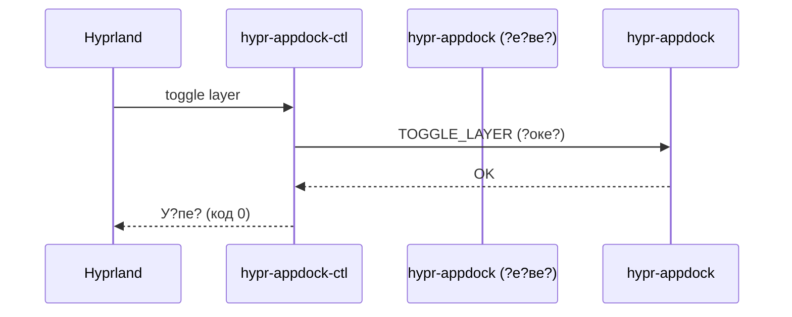

### **Те?ни?е?кое задание: ?еализа?и? `hypr-appdock-ctl` дл? ?п?авлени? hypr-appdock**  

#### **1. Цел?**  
Созда?? **о?дел?н?й CLI-бина?ник** `hypr-appdock-ctl` дл? ?п?авлени? доком ?е?ез IPC, обе?пе?ив:  
- **Смен? ?ежима ?ло?** (`auto` ??`exclusive`) без пе?езап??ка дока.  
- **?динооб?азие ? `hyprctl`** (?ин?ак?и?, ?лаги, в?вод).  
- **?а???аби??емо???** дл? б?д??и? команд (?ем?, на???ойки, ??а???).  

---

### **2. Т?ебовани?**  

#### **2.1. ?азов?й ??нк?ионал (v1.0)**  
- **?оманда `toggle`**  
  ```bash
  hypr-appdock-ctl toggle layer  # ?е?екл??ае? межд? auto и exclusive
  ```  
  - ??п?авл?е? команд? ?е?ез **Unix-socket** (`/tmp/hypr-appdock.sock`).  
  - ??ли док **не зап??ен** ??игно?и??е? команд? (или в?води? о?ибк?).  

- **?оманда `get`**  
  ```bash
  hypr-appdock-ctl get layer     # ??води? ?ек??ий ?ежим (auto/exclusive)
  ```  
  - ?озв?а?ае? ?ек?? или JSON (е?ли `--json`).  

- **?н?ег?а?и? ? Hyprland**  
  ```bash
  bind = SuperShift, D, exec, hypr-appdock-ctl toggle layer
  ```  

#### **2.2. ?ополни?ел?н?е ??ебовани?**  
- **?дин?й ??ил? ? `hyprctl`**:  
  - ?одде?жка ?лагов `--json`, `--help`.  
  - Ч??кие ?ооб?ени? об о?ибка? (нап?име?, `Dock is not running`).  
- **Тол?ко один ин??ан? дока**:  
  - ??и зап??ке `hypr-appdock` п?ове??е???, ??о ?оке? ?вободен.  

---

### **3. ?он?еп?и? ?еализа?ии**  

#### **3.1. IPC-п?о?окол**  
- **Фо?ма? команд**: Тек??ов?е ???оки (дл? п?о??о??).  
  ```text
  TOGGLE_LAYER
  GET_LAYER
  ```  
- **??ве??**:  
  - `OK` ????пе?.  
  - `ERROR: Not running` ??док не ак?ивен.  
  - `auto`/`exclusive` ??дл? `get`.  

#### **3.2. С?ема взаимодей??ви?**  


#### **3.3. ?б?або?ка о?ибок**  
| Си??а?и?                  | ?ей??вие                          |
|---------------------------|-----------------------------------|
| ?ок не зап??ен            | `ERROR: Dock is not running`      |
| ?еве?на? команда          | `ERROR: Unknown command`          |
| Соке? зан??/недо???пен    | `ERROR: Cannot connect to dock`   |

---

### **4. ?озможн?е ?а??и?ени? (б?д??ие ве??ии)**  

#### **4.1. Уп?авление ?емами**  
```bash
hypr-appdock-ctl set theme dark
hypr-appdock-ctl get theme
```  

#### **4.2. ?инами?е?кие на???ойки**  
```bash
hypr-appdock-ctl set margin 10
hypr-appdock-ctl set spacing 5
```  

#### **4.3. С?а??? и о?ладка**  
```bash
hypr-appdock-ctl status  # ??вод в?е? па?аме??ов (JSON)
hypr-appdock-ctl reload  # ?е?езаг??зка кон?ига
```  

#### **4.4. ?н?ег?а?и? ? `hyprctl`**  
? б?д??ем ??добавление подкоманд в `hyprctl`:  
```bash
hyprctl dock toggle layer
hyprctl dock get theme
```  

---
### **5. Э?ап? ?еализа?ии**  
1. **?еализа?и? IPC-?е?ве?а** в `hypr-appdock` (об?або?ка команд).  
2. **Создание `hypr-appdock-ctl`** ? командами `toggle` и `get`.  
3. **Те??и?ование**:  
   - ?ап??к/о??ановка дока.  
   - ?онк??ен?и? за ?оке?.  
4. **?ок?мен?а?и?**:  
   - `man hypr-appdock-ctl`.  
   - ??име?? дл? `hyprland.conf`.  
