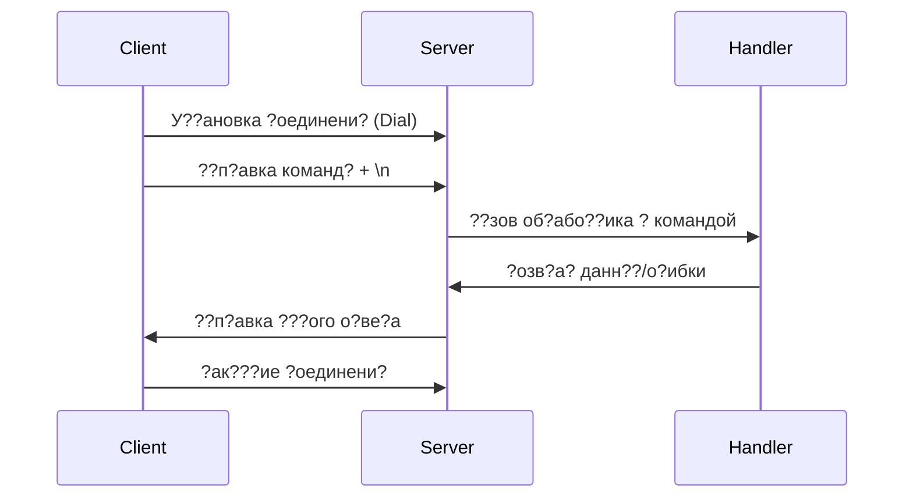

# **??оек?на? док?мен?а?и? мод?л? dockIPC**

## **1. ?он?еп?и? мод?л?**

### **1.1 ?азна?ение**
?од?л? `dockIPC` п?едо??авл?е? минимали??и?н?й API дл? о?ганиза?ии межп?о?е??ного взаимодей??ви? (IPC) ?е?ез Unix domain sockets. ??новн?е ?ели:
- Создание ??абил?ного канала комм?ника?ии межд? демоном и клиен?ами
- ?одде?жка ?ин??онного зап?о?-о?ве? взаимодей??ви?
- ?бе?пе?ение п?о??ой ин?ег?а?ии без ?ложн?? зави?имо??ей

### **1.2 ?л??ев?е п?ин?ип?**
1. **?инимализм** - ?ол?ко базов?е ??нк?ии дл? IPC
2. **?демпо?ен?но???** - пов?о?н?е в?зов? да?? одинаков?й ?ез?л??а?
3. **??ома?но???** - кажда? опе?а?и? либо заве??ае??? полно????, либо не в?полн?е???
4. **?о?окобезопа?но???** - ко??ек?на? ?або?а в многопо?о?ной ??еде

---

## **2. ???и?ек???н?е компонен??**

### **2.1 Се?ве?на? ?а???**
#### **?лго?и?м ?або??:**
1. **?ни?иализа?и? ?оке?а**
   - Удаление ???е??в???его ?айла ?оке?а (а?ома?на? опе?а?и?)
   - Создание нового Unix domain socket
   - У??ановка п?ав до???па (0666)

2. **Цикл об?або?ки ?оединений**
   - ??ин??ие в?од??его ?оединени? (блоки????а? опе?а?и?)
   - ?ап??к об?або??ика ?оединени? в о?дел?ной goroutine
   - Ч?ение команд? из ?оке?а (мак?имал?н?й ?азме? - 4??)
   - ??зов пол?зова?ел??кого об?або??ика
   - ??п?авка ?ез?л??а?а об?а?но клиен??

3. **?б?або?ка о?ибок**
   - ?в?ома?и?е?кое зак???ие ?оединений п?и о?ибка?
   - ??еоб?азование о?ибок об?або??ика в ??анда??н?й ?о?ма?

### **2.2 ?лиен??ка? ?а???**
#### **?лго?и?м ?або??:**
1. **У??ановка ?оединени?**
   - ?оп??ка подкл??ени? к ???е??в???ем? ?оке??
   - Тайма?? по ?мол?ани? (?и??емн?й)

2. **?е?еда?а команд?**
   - ?апи?? ???оки команд? в ?оке?
   - ?обавление ?е?мина?о?а `\n` дл? ?е?кого ?азделени? команд

3. **?ол??ение о?ве?а**
   - Ч?ение данн?? из ?оке?а (блоки????а? опе?а?и?)
   - ?озв?а? ????? бина?н?? данн??

---

## **3. ?заимодей??вие компонен?ов**

### **3.1 ??обенно??и взаимодей??ви?**
1. **Син??онна? модел?** - клиен? блоки??е??? до пол??ени? о?ве?а
2. **С?а?и?е?кий б??е?** - ?ик?и?ованн?й ?азме? 4?? дл? п?о??о??
3. **?а?ан?и? до??авки** - либо полн?й о?ве?, либо о?ибка

---

## **4. ?лго?и?м? об?або?ки**

### **4.1 ?б?або?ка ?оединений (Server)**
1. **??л??иплек?и?ование**:
   - ?аждое ?оединение об?аба??вае??? в о?дел?ной goroutine
   - ?е? ог?ани?ени? на коли?е??во однов?еменн?? ?оединений

2. **Уп?авление ?е????ами**:
   - ?е?е?? дл? га?ан?и?ованного зак???и? ?оединений
   - ?в?ома?и?е?кое во???ановление по?ле о?ибок

3. **Фо?ма? обмена**:
   - ?оманд? - ???оки в UTF-8
   - ??ве?? - п?оизвол?н?е бина?н?е данн?е

### **4.2 ?б?або?ка о?ибок**
1. **Тип? о?ибок**:
   - ??ибки ?оединени? (?айл ?оке?а не ???е??в?е?)
   - ??ибки ??ени?/запи?и
   - ??ибки пол?зова?ел??кого об?або??ика

2. **С??а?егии**:
   - ?в?ома?и?е?кое пов?о?ное ?оздание ?оке?а
   - ??еоб?азование о?ибок в ??анда??н?й ?о?ма?
   - ?а?ан?и?ованное о?вобождение ?е????ов

---

## **5. ?он?еп?и? ?еализа?ии**

### **5.1 Се?ве?**
**?л??ев?е идеи:**
1. **?дин ?оке? - много ?оединений**:
   - ??новной ?икл п?инимае? ?оединени?
   - ?аждое ?оединение - о?дел?н?й ?кземпл?? об?або??ика

2. **?зол??и? ?о??о?ний**:
   - ?е? ?аздел?емого ?о??о?ни? межд? об?або??иками
   - ??е зави?имо??и инжек????? ?е?ез зам?кани?

3. **?ибко??? об?або?ки**:
   - ?ол?зова?ел??кий об?або??ик може? ?еализов?ва?? л?б?? логик?
   - ?одде?жка как ?ек??ов??, ?ак и бина?н?? п?о?околов

### **5.2 ?лиен?**
**?л??ев?е идеи:**
1. **??о??о?а и?пол?зовани?**:
   - ?дна ??нк?и? дл? о?п?авки команд
   - ??оз?а?ное ?п?авление ?оединением

2. **?е?е?мини?ованно???**:
   - Че?кое ?азделение команд ?е?ез `\n`
   - ??ед?каз?ем?й ?азме? б??е?а

3. **?а??и??емо???**:
   - ?озможно??? добавлени? ?айма??ов
   - ?одде?жка ?азн?? ???а?егий ?е?иализа?ии

---

## **6. ?г?ани?ени? и доп??ени?**

1. **?азме? ?ооб?ений**:
   - ?ак?имал?н?й ?азме? - 4?? (можно ?вели?и?? п?и необ?одимо??и)
   - ?е? подде?жки по?оковой пе?еда?и

2. **?езопа?но???**:
   - ?е? ?и??овани? пе?едаваем?? данн??
   - ???ен?и?ика?и? ?е?ез п?ава ?айловой ?и??ем?

3. **??оизводи?ел?но???**:
   - ?п?имизи?овано дл? low-throughput комм?ника?ии
   - ?е под?оди? дл? high-frequency RPC

---

## **7. ?е??пек?ив? ?азви?и?**

1. **?обавление**:
   - Тайма??ов ?оединени?
   - ?одде?жки по?оковой пе?еда?и
   - ?е?анизма а??ен?и?ика?ии

2. **?п?имиза?и?**:
   - ??ла ?оединений
   - ???е?изи?ованного ввода/в?вода
   - ?олее ???ек?ивного аллока?о?а пам??и

?од?л? ?пе?иал?но ?п?оек?и?ован дл? по??епенного ?а??и?ени? ??нк?ионал?но??и п?и ?о??анении базов?? п?ин?ипов п?о??о?? и надежно??и.
